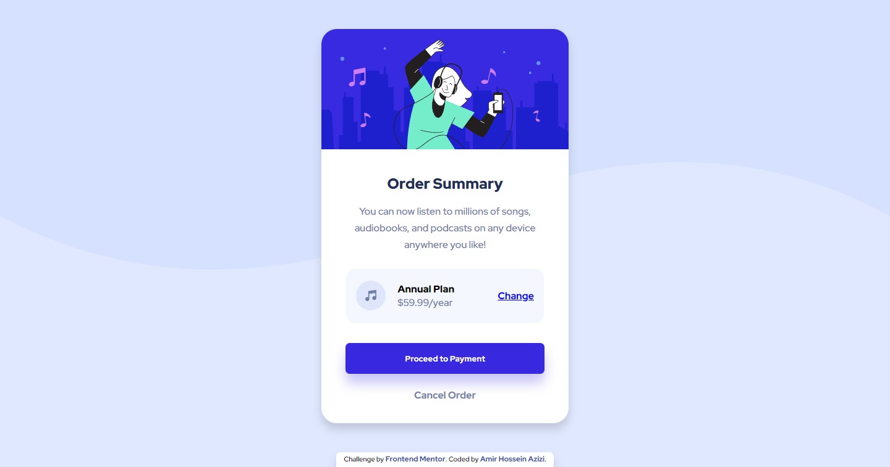

# Frontend Mentor - Order summary card solution

This is a solution to the [Order summary card challenge on Frontend Mentor](https://www.frontendmentor.io/challenges/order-summary-component-QlPmajDUj). Frontend Mentor challenges help you improve your coding skills by building realistic projects.

## Table of contents

- [Overview](#overview)
  - [Screenshot](#screenshot)
  - [Live Site](#livesite)
  - [Built with](#built-with)
- [Author](#author)

## Overview

### Screenshot

### Live Site

[Click Here](https://lovely-sherbet-284170.netlify.app/)

### Built with

- Semantic HTML5 markup
- CSS custom properties
- CSS Grid

## Author

- Amir Hossein Azizi
- Frontend Mentor - [@amirhazizi](https://www.frontendmentor.io/profile/amirhazizi)
